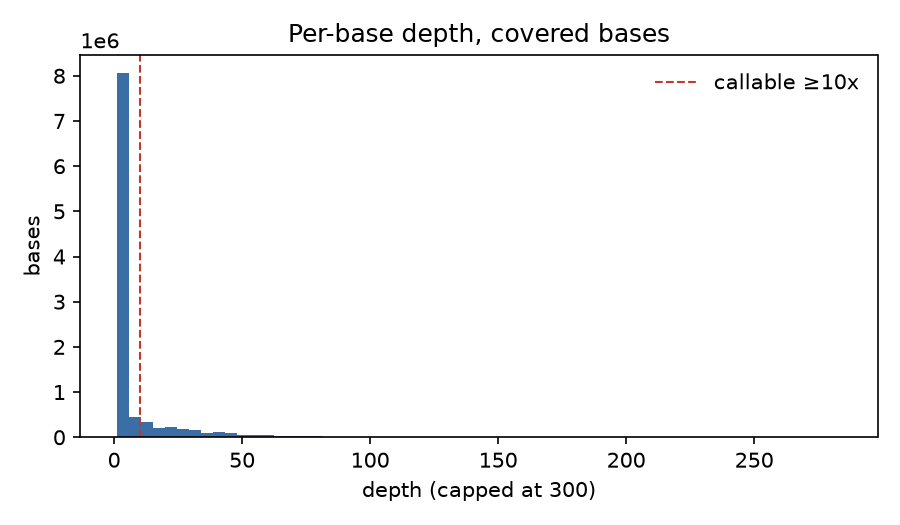
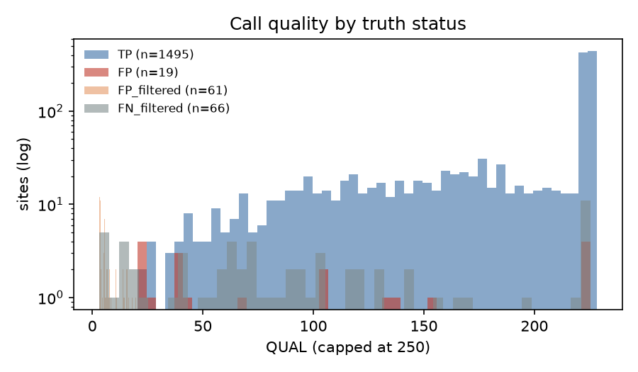

# Variant-calling QC report

## Read QC (fastp)

| metric | before | after |
|---|---|---|
| reads | 40,406,004 | 37,823,110 |
| Q30 bases | 90.8% | 94.0% |
| GC content | 49.7% | 49.3% |

## Alignment QC

| metric | value |
|---|---|
| mapped (whole BAM) | 100.00% |
| properly paired | 99.46% |
| duplicate rate | 6.1% |
| mismatch/error rate (region) | 0.0021 |
| mean insert size (region) | 169.0 |
| mean base quality (region) | 36.2 |

## Coverage

- Bases with any coverage: 10,288,616
- Median depth where covered: 2x
- Bases at >= 10x: 1,845,591
- GIAB high-confidence bases on this chromosome: 56,000,154

## Accuracy vs GIAB truth (high-confidence ∩ callable)

| type   |   truth |   calls |   TP |   FP |   FN |   precision |   recall |     F1 |   GT_concordance |
|:-------|--------:|--------:|-----:|-----:|-----:|------------:|---------:|-------:|-----------------:|
| SNV    |    1451 |    1384 | 1376 |    8 |   75 |      0.9942 |   0.9483 | 0.9707 |           0.9985 |
| INDEL  |     144 |     130 |  119 |   11 |   25 |      0.9154 |   0.8264 | 0.8686 |           0.916  |
| ALL    |    1595 |    1514 | 1495 |   19 |  100 |      0.9875 |   0.9373 | 0.9617 |           0.992  |

## Sites to review in IGV

Highest-QUAL false positives:

| chrom   |      pos | ref   | alt   | type   | status   | filter   |   qual |   dp | call_zyg   |   truth_zyg |
|:--------|---------:|:------|:------|:-------|:---------|:---------|-------:|-----:|:-----------|------------:|
| chr20   |  1915306 | T     | C     | SNV    | FP       | PASS     |  225.4 |   17 | hom_alt    |         nan |
| chr20   |  1915305 | C     | T     | SNV    | FP       | PASS     |  225.4 |   16 | hom_alt    |         nan |
| chr20   |  1915304 | C     | G     | SNV    | FP       | PASS     |  225.4 |   17 | hom_alt    |         nan |
| chr20   | 55074915 | CAGAA | C     | INDEL  | FP       | PASS     |  222.4 |  102 | het        |         nan |
| chr20   | 35000899 | G     | C     | SNV    | FP       | PASS     |  155.4 |   10 | hom_alt    |         nan |
| chr20   | 25452811 | C     | CTT   | INDEL  | FP       | PASS     |  137.1 |   14 | het        |         nan |
| chr20   |  1915067 | T     | TAAA  | INDEL  | FP       | PASS     |  134.4 |   11 | het        |         nan |
| chr20   | 13580985 | TAAA  | T     | INDEL  | FP       | PASS     |  105.4 |   15 | het        |         nan |
| chr20   | 36230772 | CTT   | C     | INDEL  | FP       | PASS     |  104.4 |   32 | het        |         nan |
| chr20   |  2652758 | C     | G     | SNV    | FP       | PASS     |   68.9 |   15 | het        |         nan |
| chr20   | 49153906 | CAA   | C     | INDEL  | FP       | PASS     |   43.5 |   12 | het        |         nan |
| chr20   |  5501412 | C     | T     | SNV    | FP       | PASS     |   40.1 |   42 | het        |         nan |
| chr20   | 31922939 | AATT  | A     | INDEL  | FP       | PASS     |   37.5 |   35 | het        |         nan |
| chr20   | 52097453 | ATT   | A     | INDEL  | FP       | PASS     |   37.4 |   15 | het        |         nan |
| chr20   |   888449 | C     | A     | SNV    | FP       | PASS     |   27.5 |   11 | het        |         nan |

False negatives (first 15):

| chrom   |      pos | ref   | alt        | type   | status   |   filter |   qual |   dp |   call_zyg | truth_zyg   |
|:--------|---------:|:------|:-----------|:-------|:---------|---------:|-------:|-----:|-----------:|:------------|
| chr20   |   764018 | A     | ACAGGTCAAT | INDEL  | FN       |      nan |    nan |  nan |        nan | het         |
| chr20   |  1915303 | A     | AGT        | INDEL  | FN       |      nan |    nan |  nan |        nan | hom_alt     |
| chr20   |  1915304 | CCT   | C          | INDEL  | FN       |      nan |    nan |  nan |        nan | hom_alt     |
| chr20   |  5474151 | C     | T          | SNV    | FN       |      nan |    nan |  nan |        nan | het         |
| chr20   |  5474155 | G     | A          | SNV    | FN       |      nan |    nan |  nan |        nan | het         |
| chr20   |  5474227 | C     | T          | SNV    | FN       |      nan |    nan |  nan |        nan | het         |
| chr20   |  5474313 | G     | A          | SNV    | FN       |      nan |    nan |  nan |        nan | het         |
| chr20   |  5474428 | T     | C          | SNV    | FN       |      nan |    nan |  nan |        nan | het         |
| chr20   |  5474467 | C     | A          | SNV    | FN       |      nan |    nan |  nan |        nan | het         |
| chr20   |  9389859 | G     | GT         | INDEL  | FN       |      nan |    nan |  nan |        nan | het         |
| chr20   | 12380022 | G     | A          | SNV    | FN       |      nan |    nan |  nan |        nan | het         |
| chr20   | 23376691 | A     | G          | SNV    | FN       |      nan |    nan |  nan |        nan | het         |
| chr20   | 23376692 | A     | C          | SNV    | FN       |      nan |    nan |  nan |        nan | het         |
| chr20   | 32704496 | CA    | C          | INDEL  | FN       |      nan |    nan |  nan |        nan | het         |
| chr20   | 34845112 | T     | TCACCAC    | INDEL  | FN       |      nan |    nan |  nan |        nan | het         |

## Haplotype-aware benchmark (rtg vcfeval)

Run after the positional evaluation above with `scripts/07_vcfeval.sh` (same evaluation BED, PASS calls, QUAL as score).
vcfeval reconciles different representations of the same variant and, by default, requires the genotype to match.

| type  | TP   | FP | FN  | precision | recall | F1     |
|:------|-----:|---:|----:|----------:|-------:|-------:|
| SNV   | 1377 |  7 |  77 |    0.9949 | 0.9470 | 0.9704 |
| INDEL |  108 | 22 |  31 |    0.8308 | 0.7770 | 0.8030 |
| ALL   | 1485 | 29 | 108 |    0.9808 | 0.9322 | 0.9559 |

With `--squash-ploidy` (allele match only, ignoring genotype): SNV 1379/5/75, INDEL 119/11/20, ALL F1 0.9643.
This agrees with the positional script, so the lower genotype-aware INDEL F1 comes from 11 indels called het
where the truth is hom-alt (or vice versa), each counted as one FP plus one FN.

Findings from the site review:

- The apparent FP cluster at chr20:1915304-1915306 (three hom-alt SNVs) and the paired FN indels at 1915303-1915304
  are the same complex variant in two representations. vcfeval scores all of them as TP.
- The six het SNV false negatives at chr20:5474151-5474467 are not a depth problem (mean 43x, 172/184 reads MAPQ >= 20).
  Every read in the window carries an XA tag pointing to chr20:5.50 Mb, a segmental duplication ~27 kb away.
  The pileup shows 0-1 alt reads at each site, so the alt-haplotype reads have been placed on the paralog; the
  het FP SNV at chr20:5501412 (DP 42) is the same signal showing up on the other copy. A short-read caller cannot
  recover these; they are a known limitation of BWA-MEM in recent duplications.
- Remaining FP indels are mostly low-support (2-7 alt reads) 1-3 bp changes in homopolymer or short tandem repeats,
  plus three sites where bcftools emitted two alt alleles at one position (1915067, 25452811, 49153906) and only
  one matches the truth.
