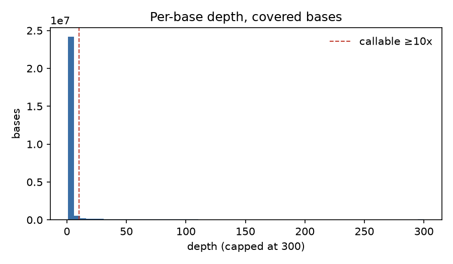
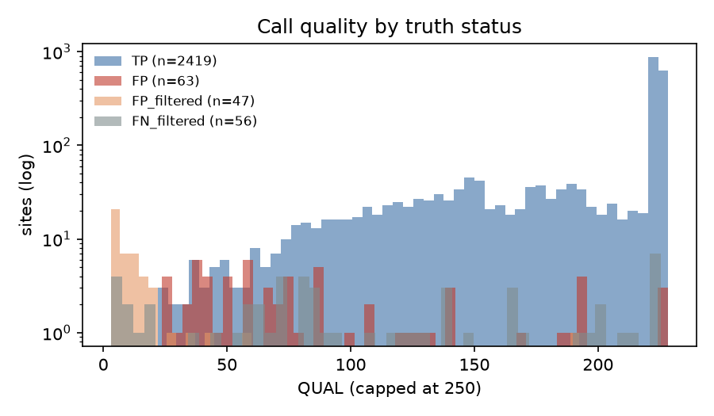

# Variant-calling QC report

## Read QC (fastp)

| metric | before | after |
|---|---|---|
| reads | 168,453,484 | 157,576,398 |
| Q30 bases | 90.8% | 93.9% |
| GC content | 49.6% | 49.2% |

## Alignment QC

| metric | value |
|---|---|
| mapped (whole BAM) | 100.00% |
| properly paired | 99.43% |
| duplicate rate | 14.1% |
| mismatch/error rate (region) | 0.0021 |
| mean insert size (region) | 172.3 |
| mean base quality (region) | 36.2 |

## Coverage

- Bases with any coverage: 27,455,204
- Median depth where covered: 2x
- Bases at >= 10x: 2,768,480
- GIAB high-confidence bases on this chromosome: 56,000,154

## Accuracy vs GIAB truth (high-confidence ∩ callable)

| type   |   truth |   calls |   TP |   FP |   FN |   precision |   recall |     F1 |   GT_concordance |
|:-------|--------:|--------:|-----:|-----:|-----:|------------:|---------:|-------:|-----------------:|
| SNV    |    2272 |    2232 | 2213 |   19 |   59 |      0.9915 |   0.974  | 0.9827 |           0.9959 |
| INDEL  |     243 |     250 |  206 |   44 |   37 |      0.824  |   0.8477 | 0.8357 |           0.8786 |
| ALL    |    2515 |    2482 | 2419 |   63 |   96 |      0.9746 |   0.9618 | 0.9682 |           0.9859 |

## Sites to review in IGV

Highest-QUAL false positives:

| chrom   |      pos | ref           | alt     | type   | status   | filter   |   qual |   dp | call_zyg   |   truth_zyg |
|:--------|---------:|:--------------|:--------|:-------|:---------|:---------|-------:|-----:|:-----------|------------:|
| chr20   |  1915304 | C             | G       | SNV    | FP       | PASS     |  228.3 |   49 | hom_alt    |         nan |
| chr20   |  1915306 | T             | C       | SNV    | FP       | PASS     |  228.3 |   47 | hom_alt    |         nan |
| chr20   |  1915305 | C             | T       | SNV    | FP       | PASS     |  228.3 |   44 | hom_alt    |         nan |
| chr20   | 25452811 | C             | CTT     | INDEL  | FP       | PASS     |  194.6 |   66 | het        |         nan |
| chr20   | 49067031 | CAAAAAAAAAAAA | C       | INDEL  | FP       | PASS     |  194.6 |   15 | het        |         nan |
| chr20   | 36230772 | CTTT          | C       | INDEL  | FP       | PASS     |  193.1 |  139 | het        |         nan |
| chr20   | 36230772 | CTT           | C       | INDEL  | FP       | PASS     |  193.1 |  139 | het        |         nan |
| chr20   | 33015599 | TAAA          | T       | INDEL  | FP       | PASS     |  191.2 |   13 | het        |         nan |
| chr20   |   159274 | T             | TAAA    | INDEL  | FP       | PASS     |  186.1 |   11 | het        |         nan |
| chr20   | 35000899 | G             | C       | SNV    | FP       | PASS     |  167.3 |   27 | hom_alt    |         nan |
| chr20   | 49257702 | CTTTT         | C       | INDEL  | FP       | PASS     |  141.5 |   32 | het        |         nan |
| chr20   | 49257702 | CTT           | C       | INDEL  | FP       | PASS     |  141.5 |   32 | het        |         nan |
| chr20   | 48998537 | TAA           | T       | INDEL  | FP       | PASS     |  140.2 |   21 | het        |         nan |
| chr20   | 58874685 | T             | C       | SNV    | FP       | PASS     |  132.4 |   26 | het        |         nan |
| chr20   | 49633439 | G             | GTTTTGT | INDEL  | FP       | PASS     |  129.2 |   21 | het        |         nan |

False negatives (first 15):

| chrom   |     pos | ref     | alt                    | type   | status   |   filter |   qual |   dp |   call_zyg | truth_zyg   |
|:--------|--------:|:--------|:-----------------------|:-------|:---------|---------:|-------:|-----:|-----------:|:------------|
| chr20   |  257794 | CTGGTCT | C                      | INDEL  | FN       |      nan |    nan |  nan |        nan | het         |
| chr20   | 1113445 | A       | AAC                    | INDEL  | FN       |      nan |    nan |  nan |        nan | het         |
| chr20   | 1915303 | A       | AGT                    | INDEL  | FN       |      nan |    nan |  nan |        nan | hom_alt     |
| chr20   | 1915304 | CCT     | C                      | INDEL  | FN       |      nan |    nan |  nan |        nan | hom_alt     |
| chr20   | 2637387 | C       | CAAAA                  | INDEL  | FN       |      nan |    nan |  nan |        nan | het         |
| chr20   | 2652752 | GGCCTGC | G                      | INDEL  | FN       |      nan |    nan |  nan |        nan | het         |
| chr20   | 2705785 | CCACA   | C                      | INDEL  | FN       |      nan |    nan |  nan |        nan | het         |
| chr20   | 3687101 | C       | CG                     | INDEL  | FN       |      nan |    nan |  nan |        nan | hom_alt     |
| chr20   | 3800210 | T       | TGGACTGGAGACCTGGTGCTAG | INDEL  | FN       |      nan |    nan |  nan |        nan | het         |
| chr20   | 5474151 | C       | T                      | SNV    | FN       |      nan |    nan |  nan |        nan | het         |
| chr20   | 5474155 | G       | A                      | SNV    | FN       |      nan |    nan |  nan |        nan | het         |
| chr20   | 5474227 | C       | T                      | SNV    | FN       |      nan |    nan |  nan |        nan | het         |
| chr20   | 5474313 | G       | A                      | SNV    | FN       |      nan |    nan |  nan |        nan | het         |
| chr20   | 5474428 | T       | C                      | SNV    | FN       |      nan |    nan |  nan |        nan | het         |
| chr20   | 5474467 | C       | A                      | SNV    | FN       |      nan |    nan |  nan |        nan | het         |

## Haplotype-aware benchmark (rtg vcfeval), full four-lane evaluation region

| type  | TP   | FP | FN  | precision | recall | F1     |
|:------|-----:|---:|----:|----------:|-------:|-------:|
| SNV   | 2207 | 25 |  68 |    0.9888 | 0.9701 | 0.9794 |
| INDEL |  179 | 74 |  58 |    0.7075 | 0.7553 | 0.7306 |
| ALL   | 2386 | 99 | 126 |    0.9602 | 0.9498 | 0.9550 |

## Comparison with the single-lane run (job 20562709)

Merging all four Garvan lanes (NIST7035 L001+L002, NIST7086 L001+L002) raised reads from 40.4M to 168.5M
(duplicate rate 6.1% to 14.1%) and grew the evaluation region (high-confidence ∩ callable at >= 10x) from
1.74 Mb to 2.58 Mb, so the full-region numbers above are not directly comparable to the single-lane report.
The table below rescores both call sets with vcfeval on the **single-lane evaluation BED**, which is entirely
contained in the four-lane BED.

| run    | mode        | type  |   TP |  FP |  FN | precision | recall |     F1 |
|:-------|:------------|:------|-----:|----:|----:|----------:|-------:|-------:|
| 1-lane | genotype    | SNV   | 1377 |   7 |  77 |    0.9949 | 0.9470 | 0.9704 |
| 4-lane | genotype    | SNV   | 1442 |  10 |  12 |    0.9931 | 0.9917 | 0.9924 |
| 1-lane | genotype    | INDEL |  108 |  22 |  31 |    0.8308 | 0.7770 | 0.8030 |
| 4-lane | genotype    | INDEL |  115 |  41 |  24 |    0.7372 | 0.8273 | 0.7797 |
| 1-lane | allele-only | INDEL |  119 |  11 |  20 |    0.9154 | 0.8561 | 0.8848 |
| 4-lane | allele-only | INDEL |  129 |  27 |  10 |    0.8269 | 0.9281 | 0.8746 |

Takeaways:

- **SNVs benefit cleanly from depth.** Recall goes from 0.947 to 0.992 on the same region; only 12 SNVs are
  still missed, six of which are the paralog cluster at chr20:5474151-5474467 (still 0 alt reads at 4 lanes,
  as expected for a mapping artifact).
- **Indel recall improves (0.856 to 0.928) but precision falls (0.915 to 0.827).** With more depth, bcftools
  emits more low-allele-fraction indels in homopolymers and short tandem repeats. Of the 74 GT-aware FP indels
  on the full region, 39 have alt fraction below 0.35 and 17 below 0.2. These are the natural target for a
  stricter indel filter (allele fraction or IMF/IDV thresholds), or for a local-assembly caller.
- **Genotype errors are the other half of the indel gap.** 14 of the 41 GT-aware indel FPs on the common region
  have the right allele and wrong genotype, versus 11 at one lane.
