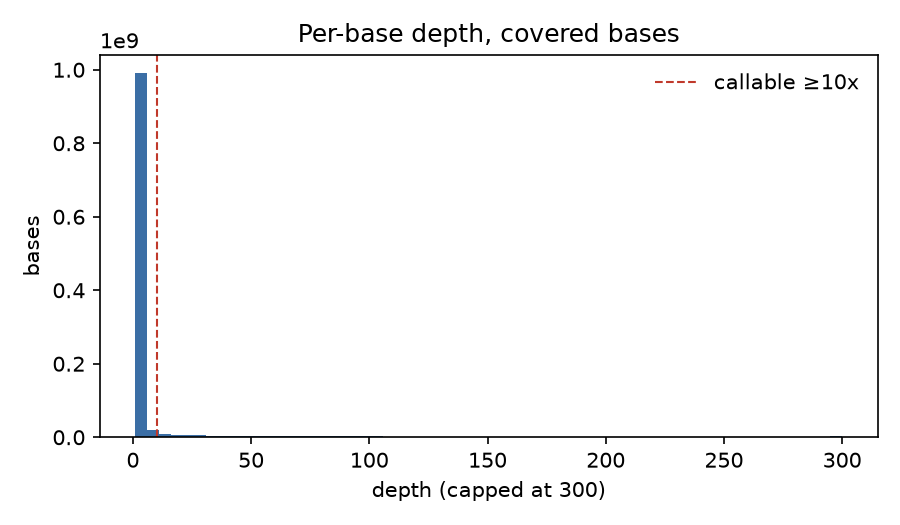
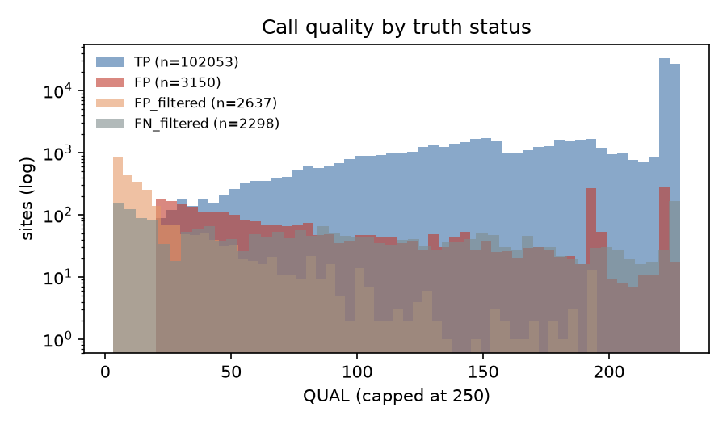

# Variant-calling QC report

## Read QC (fastp)

| metric | before | after |
|---|---|---|
| reads | 168,453,484 | 157,576,398 |
| Q30 bases | 90.8% | 93.9% |
| GC content | 49.6% | 49.2% |

## Alignment QC

| metric | value |
|---|---|
| mapped (whole BAM) | 100.00% |
| properly paired | 99.43% |
| duplicate rate | 14.1% |
| mismatch/error rate (region) | 0.0020 |
| mean insert size (region) | 178.5 |
| mean base quality (region) | 36.4 |

## Coverage

- Bases with any coverage: 1,116,997,285
- Median depth where covered: 2x
- Bases at >= 10x: 107,328,381 (median depth 63x)
- GIAB high-confidence bases in region: 2,512,291,789
- Evaluation territory (high-confidence ∩ callable): 101,269,122

## Accuracy vs GIAB truth (high-confidence ∩ callable)

| type   |   truth |   calls |     TP |   FP |   FN |   precision |   recall |     F1 |   GT_concordance |
|:-------|--------:|--------:|-------:|-----:|-----:|------------:|---------:|-------:|-----------------:|
| SNV    |   95635 |   94058 |  92640 | 1418 | 2995 |      0.9849 |   0.9687 | 0.9767 |           0.997  |
| INDEL  |   11206 |   11145 |   9413 | 1732 | 1793 |      0.8446 |   0.84   | 0.8423 |           0.9057 |
| ALL    |  106841 |  105203 | 102053 | 3150 | 4788 |      0.9701 |   0.9552 | 0.9626 |           0.9886 |

## Sites to review in IGV

Highest-QUAL false positives:

| chrom   |       pos | ref   | alt   | type   | status   | filter   |   qual |   dp | call_zyg   |   truth_zyg |
|:--------|----------:|:------|:------|:-------|:---------|:---------|-------:|-----:|:-----------|------------:|
| chr19   |  33207751 | G     | GGGC  | INDEL  | FP       | PASS     |  228.4 |   36 | hom_alt    |         nan |
| chr20   |   1915304 | C     | G     | SNV    | FP       | PASS     |  228.3 |   49 | hom_alt    |         nan |
| chr17   |  22521429 | G     | C     | SNV    | FP       | PASS     |  228.3 |   13 | hom_alt    |         nan |
| chr17   |  22521426 | T     | C     | SNV    | FP       | PASS     |  228.3 |   13 | hom_alt    |         nan |
| chr1    |  45694137 | T     | A     | SNV    | FP       | PASS     |  228.3 |   26 | hom_alt    |         nan |
| chr1    |  45694141 | AATAT | A     | INDEL  | FP       | PASS     |  228.3 |  130 | hom_alt    |         nan |
| chr20   |   1915306 | T     | C     | SNV    | FP       | PASS     |  228.3 |   47 | hom_alt    |         nan |
| chr8    |  19404624 | T     | A     | SNV    | FP       | PASS     |  228.3 |   18 | hom_alt    |         nan |
| chr20   |   1915305 | C     | T     | SNV    | FP       | PASS     |  228.3 |   44 | hom_alt    |         nan |
| chr3    | 130264145 | CCG   | C     | INDEL  | FP       | PASS     |  228.2 |   93 | hom_alt    |         nan |
| chr3    | 130264155 | T     | C     | SNV    | FP       | PASS     |  225.4 |   19 | hom_alt    |         nan |
| chr17   |  22521407 | G     | A     | SNV    | FP       | PASS     |  225.4 |   13 | hom_alt    |         nan |
| chr16   |  24219656 | A     | C     | SNV    | FP       | PASS     |  225.4 |   45 | hom_alt    |         nan |
| chr1    |  89423029 | G     | T     | SNV    | FP       | PASS     |  225.4 |   38 | hom_alt    |         nan |
| chr1    | 221182779 | G     | A     | SNV    | FP       | PASS     |  225.4 |  112 | hom_alt    |         nan |

False negatives (first 15):

| chrom   |      pos | ref                              | alt                                             | type   | status   |   filter |   qual |   dp |   call_zyg | truth_zyg   |
|:--------|---------:|:---------------------------------|:------------------------------------------------|:-------|:---------|---------:|-------:|-----:|-----------:|:------------|
| chr1    |   988819 | G                                | GGAGTGTTTCGGGAGTTCTGGGTTGATTGTTTCTGGAGTTCAGGGTT | INDEL  | FN       |      nan |    nan |  nan |        nan | hom_alt     |
| chr1    |  1310876 | CGGCTCTGGGTCACAGGT               | C                                               | INDEL  | FN       |      nan |    nan |  nan |        nan | het         |
| chr1    |  1676135 | C                                | T                                               | SNV    | FN       |      nan |    nan |  nan |        nan | het         |
| chr1    |  1676273 | C                                | T                                               | SNV    | FN       |      nan |    nan |  nan |        nan | het         |
| chr1    |  1699127 | T                                | C                                               | SNV    | FN       |      nan |    nan |  nan |        nan | het         |
| chr1    |  1705555 | A                                | G                                               | SNV    | FN       |      nan |    nan |  nan |        nan | het         |
| chr1    |  1708855 | TTCCTCCTCC                       | T                                               | INDEL  | FN       |      nan |    nan |  nan |        nan | het         |
| chr1    |  1722625 | A                                | T                                               | SNV    | FN       |      nan |    nan |  nan |        nan | hom_alt     |
| chr1    |  1734812 | G                                | A                                               | SNV    | FN       |      nan |    nan |  nan |        nan | hom_alt     |
| chr1    |  1745681 | A                                | C                                               | SNV    | FN       |      nan |    nan |  nan |        nan | hom_alt     |
| chr1    |  1745808 | A                                | G                                               | SNV    | FN       |      nan |    nan |  nan |        nan | hom_alt     |
| chr1    |  1745814 | T                                | C                                               | SNV    | FN       |      nan |    nan |  nan |        nan | hom_alt     |
| chr1    |  3021843 | CAGA                             | C                                               | INDEL  | FN       |      nan |    nan |  nan |        nan | het         |
| chr1    |  3403037 | ACCCTCCTCTGAGTCTTCCTCCCCTTCCCGTG | A                                               | INDEL  | FN       |      nan |    nan |  nan |        nan | het         |
| chr1    | 10341951 | CA                               | C                                               | INDEL  | FN       |      nan |    nan |  nan |        nan | het         |

## Haplotype-aware benchmark (rtg vcfeval), chr1-22

Four-lane merged BAM from job 20570014 (not realigned), `REGION=autosomes`, PASS calls including the
`IndelLowAF` filter (indel alt fraction < 0.2). Evaluation territory: 101.3 Mb.

| type  | TP     | FP   | FN   | precision | recall | F1     |
|:------|-------:|-----:|-----:|----------:|-------:|-------:|
| SNV   | 92317  | 1741 | 3285 |    0.9815 | 0.9656 | 0.9735 |
| INDEL |  8376  | 2829 | 2632 |    0.7475 | 0.7609 | 0.7542 |
| ALL   | 100693 | 4570 | 5917 |    0.9566 | 0.9445 | 0.9505 |

## Held-out check of the indel filter

The 0.2 threshold was chosen by sweeping allele-fraction and IDV cutoffs on chr20 only. Indel scores with
and without `IndelLowAF` (`vcfeval/indel_filter_holdout.tsv`, script alongside):

| chromosomes | mode | F1 without | F1 with | precision change | recall change |
|:--|:--|--:|--:|--:|--:|
| chr20 (tuning) | genotype | 0.7306 | 0.7463 | +0.047 | -0.017 |
| chr1-19, 21, 22 (held out) | genotype | 0.7457 | 0.7543 | +0.030 | -0.015 |
| chr1-19, 21, 22 (held out) | allele-only | 0.8332 | 0.8423 | +0.033 | -0.018 |

The gain carries over to unseen chromosomes, somewhat smaller than on chr20. The chr20 counts here match the
chr20-only four-lane run exactly, so the per-chromosome rewrite of steps 3-4 reproduces the earlier results.

Notes:

- 139 of the 163 SNV false negatives on chr6 fall in the MHC (chr6:28.5-33.5 Mb), the largest single cluster
  genome-wide; like the chr20:5.47 Mb paralog cluster, this is a short-read mapping limit rather than depth.
- The remaining indel error is mostly outside the reach of a post-call filter: wrong-allele calls in repeats and
  right-allele/wrong-genotype calls, many from sites bcftools calls as two different indel alleles (1/2).
